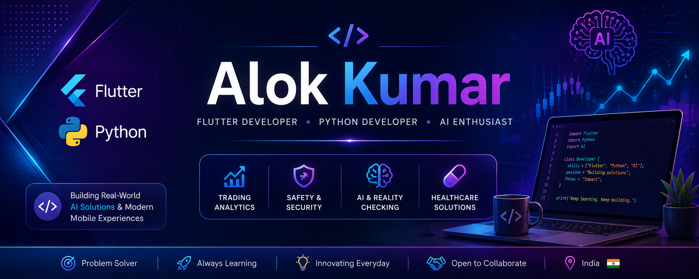

  

<h1 align="center">Hi 👋, I'm Alok Kumar</h1>

<h3 align="center">
🚀 Flutter Developer • 🤖 AI Enthusiast • 📱 Android App Developer
</h3>

Building AI-powered mobile applications that solve real-world problems.

  

---

# 🚀 Current Focus

- 🛡️ AI-powered Personal Safety Applications
- 📈 Trading Technology & Market Analytics
- 💊 Healthcare & Medication Management
- 🤖 Artificial Intelligence & Mobile Innovation

---

# 👨‍💻 About Me

- 🔭 Currently building AI-powered Flutter applications
- 🌱 Learning Artificial Intelligence, Machine Learning & Secure Mobile Development
- 💡 Passionate about solving real-world problems using technology
- 🎯 Goal: Build products used by millions of people

---

# 🚀 Featured Projects

## 📈 TradePilot AI

AI-powered intraday trading assistant featuring intelligent market analysis, price action concepts and modern Flutter UI.

---

## 🛡️ GuardianEye AI

Privacy-first emergency and personal safety application with intelligent assistance and AI-powered protection features.

---

## 💊 MediCare Pro

Smart medicine reminder and healthcare management application with scheduling and notification features.

---

## 🔍 AI Reality Checker

AI-assisted application that helps verify digital content and detect misinformation.

---

# 💻 Tech Stack

## 📱 Mobile Development

---

## 💻 Programming Languages

---

## ⚙️ Backend

---

## 🗄️ Database

---

## 🛠️ Tools

---

# 📚 Currently Learning

- Artificial Intelligence
- Machine Learning
- Computer Vision
- Flutter Clean Architecture
- Cyber Security
- Trading Systems

---

# 📊 GitHub Stats

---

# 🔥 GitHub Streak

---

# 🏆 GitHub Trophies

---

# 📈 Contribution Graph

---

# 🎯 Goals for 2026

- 🚀 Publish production-ready Android applications
- 🤖 Build impactful AI-powered products
- 🌍 Contribute to Open Source
- 📈 Grow as a Flutter & AI Developer

---

# 📬 Connect With Me

---

---

<h3 align="center">

⭐ Thanks for visiting my profile!

</h3>

If you like my work, don't forget to ⭐ my repositories.

